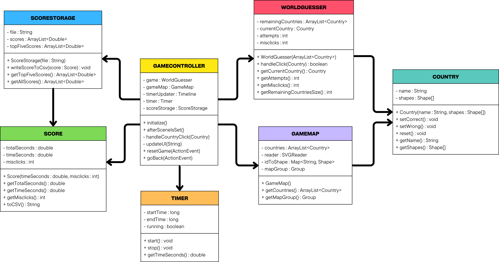

# WorldGuesser

## Beskrivelse av appen

Appen vi har lagd er en geografiquiz, hvor man må trykke på rett land på et kart. Kartet er fra en SVG-fil, og viser Europa. Når en spiller starter appen kan den enten trykke på play eller highscore. Hvis man trykker på highscore får man en liste med de topp fem beste tidene så langt, eventuelt færre dersom det ikke er spilt fem runder enda. Dersom spilleren trykker på play laster spillet inn kartet. Øverst på skjermen står det Find: (country), som viser et tilfeldig land du enda ikke har trykket på. Du har tre forsøk på å trykke på rett land. Dersom du trykker rett land, blir landet grønt, og fjernes fra lista med mulige land du kan måtte finne. Dersom du trykker feil øker antallet bomklikk, og landet du trykket på lyser rødt i 0.5 sekunder. Totaltiden din beregnes ved å ta tid + bomklikk*5. Denne totaltiden blir sendt til en csv-fil, og vil eventuelt vises i highscore dersom den er god nok.

## Diagram
Diagrammet viser strukturen i spilldelen av WorldGuesser. GameController fungerer som bindeledd mellom brukergrensesnittet og modellklassene. Den kommuniserer med WorldGuesser som håndterer spilllogikken, og GameMap som representerer kartet. Country brukes både av GameMap og WorldGuesser for å representere landene i spillet. Timer brukes til å måle tid, som Score og ScoreStorage bruker til beregning og lagring av resultater gjennom GameController.

## Refleksjon

### 1. Dekning av pensum
Prosjektet vårt dekker flere viktige deler av pensum. Først og fremst har vi brukt objektorientert programmering, slik at programmet er delt opp i flere ulike klasser som representerer ulike deler av systemet. Eksempelvis representerer Country-objekter fra Country-klassen ulike land i spillet, mens WorldGuesser driver selve spillogikken. Slik modelleres systemet av objekter som både har tilstand og oppførsel.

Programmet deles opp i ulike ansvarsområder til ulike klasser. For eksempel håndterer GameController brukergrensesnittet, mens Score har ansvar for å beregne resultat for runden basert på tid og bomklikk, og ScoreStorage lagrer de ulike filene i en csv-fil. Da blir koden i sin helhet mer oversiktlig og lett å vedlikeholde, noe som er viktig i objektorientert programmering.

Programmet vårt har også benyttet ArrayLists, blant annet for å finne de beste tidene fra alle rundene som er lagret i csv-filen. Vi har også benyttet JUnit-tester for å teste noen av de viktigste delene av spillogikken, slik som håndtering av feilklikk, redusering av antall forsøk igjen og beregning av score fra runder. Vi utviklet også en grafisk applikasjon i JavaFX for appen vår. Dermed har vi vært innom mange viktige deler av pensum.

### 2. Mulig dekning av resten av pensum

### 3. Model-View-Controller-prinsippet

### 4. Testing av appen

## KI Deklarasjon
Vi har hovedsakelig brukt KI som et søkeverktøy, som et alternativ til kilder som W3Schools, GeeksforGeeks, Stack Overflow og Reddit. Vi brukte også VsCodes Copilot som et hjelpemiddel når vi skulle kommentere koden.